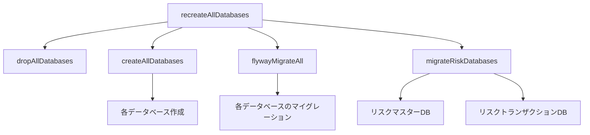

# ユニットテスト実装と実行の方針

## 1. 基本方針

### 1.1. テストコードの配置
- テストコードは `src/test/kotlin` 配下に配置
- テストリソース（SQL等）は `src/test/resources` 配下に配置
- プロダクションコードとテストコードは完全に分離

### 1.2. テストデータベースの取り扱い
- テストDBはテスト実行前に毎回クリーンアップ
- テストに必要なマイグレーションファイルは `src/test/resources/db/migration` で管理
- プロダクションのマイグレーションファイルは一切変更しない

## 2. Gradleタスク構成

### 2.1. テスト用データベース準備タスク
```kotlin
// build.gradle.kts

tasks.register("cleanTestDb") {
    group = "verification"
    description = "Cleans test database before running tests"
    doLast {
        flyway {
            url = "jdbc:mysql://localhost:3307/compliance_management_system_test"
            user = "root"
            password = "root"
            cleanDisabled = false
            clean()
        }
    }
}

tasks.register("migrateTestDb") {
    group = "verification"
    description = "Applies migrations to test database"
    dependsOn("cleanTestDb")
    doLast {
        flyway {
            url = "jdbc:mysql://localhost:3307/compliance_management_system_test"
            user = "root"
            password = "root"
            locations = arrayOf("classpath:db/migration", "classpath:db/migration/test")
            migrate()
        }
    }
}

tasks.test {
    dependsOn("migrateTestDb")
}
```

### 2.2. テスト実行の流れ
1. `cleanTestDb`: テストDB初期化
2. `migrateTestDb`: テスト用マイグレーション実行
3. `test`: ユニットテスト実行

## 3. マイグレーションファイル管理

### 3.1. テスト用マイグレーションファイルの配置
```
src/test/resources/
└── db/
    └── migration/
        ├── V1.0.1__insert_test_master_data.sql  # テスト用マスタデータ
        └── V1.0.2__insert_test_data.sql         # テストケース用データ
```

### 3.2. マイグレーションファイル管理の原則
1. テーブル定義
   - プロダクションのマイグレーションファイルを直接利用
   - Flywayの設定で、プロダクションとテストの両方のマイグレーションパスを指定
   ```kotlin
   flyway {
       locations = arrayOf(
           "classpath:db/migration",      // プロダクションのマイグレーション
           "classpath:db/migration/test"  // テスト用データ
       )
   }
   ```

2. テストデータ
   - テストに必要な最小限のデータのみを投入
   - データは各テストの意図が明確になるように設計
   - テストケース間で独立したデータセットを使用

3. マイグレーションファイルの命名規則
   - プレフィックス: `V`
   - バージョン番号: プロダクションの最終バージョンの後に続く番号から開始
   - 説明: アンダースコア2つで区切る
   - 拡張子: `.sql`

### 3.3. 禁止事項
- ✘ プロダクションのテーブル定義の複製
- ✘ テスト用のカラム追加
- ✘ テスト用のインデックスや制約の変更
- ✘ テスト用の型や長さの変更

### 3.4. 推奨プラクティス
1. テストデータの投入
   ```sql
   -- V1.0.1__insert_test_master_data.sql
   INSERT INTO M_CODE (code_category, code, name) VALUES
   ('USER_ROLE', 'ADMIN', '管理者'),
   ('USER_ROLE', 'USER', '一般ユーザー');
   ```

2. Gradleタスクの設定
   ```kotlin
   tasks.register("migrateTestDb") {
       group = "verification"
       description = "Applies migrations to test database"
       dependsOn("cleanTestDb")
       doLast {
           flyway {
               url = "jdbc:mysql://localhost:3307/compliance_management_system_test"
               user = "root"
               password = "root"
               locations = arrayOf(
                   "classpath:db/migration",      // プロダクションのマイグレーション
                   "classpath:db/migration/test"  // テスト用データ
               )
               migrate()
           }
       }
   }
   ```

## 4. テストデータ管理

### 4.1. テストデータの種類と配置
1. マスタデータ
   - 共通で使用する最小限のマスタデータ
   - `V1.0.1__insert_test_master_data.sql` で管理

2. テストケース固有データ
   - 各テストケースで必要なデータ
   - `V1.0.2__insert_test_data.sql` で管理
   - または、テストクラス内でセットアップ時に投入

### 4.2. テストデータ作成の原則
- 必要最小限のデータのみを作成
- テストの意図が明確になるようなデータ設計
- 他のテストケースに影響を与えない独立したデータ

## 5. 禁止事項

### 5.1. プロダクションコード関連
- ✘ プロダクションのマイグレーションファイルをテストのために変更
- ✘ テスト用の条件分岐をプロダクションコードに追加
- ✘ テスト用の設定をプロダクション設定ファイルに混在

### 5.2. テストコード関連
- ✘ プロダクションのマイグレーションファイルをテストから直接参照
- ✘ テスト間でデータを共有（テストの独立性を損なう）
- ✘ 実環境のDBに接続するテストの作成

## 6. テスト実装のベストプラクティス

### 6.1. テストクラスの構造
```kotlin
@SpringBootTest
class ExampleServiceTest {
    @Autowired
    private lateinit var exampleService: ExampleService

    @BeforeEach
    fun setup() {
        // テストデータのセットアップ
    }

    @Test
    fun `テストケースの説明`() {
        // テストコード
    }

    @AfterEach
    fun cleanup() {
        // 必要に応じてクリーンアップ
    }
}
```

### 6.2. テストケース設計
- 1テストにつき1つの検証項目
- テストの意図が明確な命名
- 適切なアサーション
- エッジケースの考慮

## 7. CI/CD環境での実行

### 7.1. テストデータベースの準備
```yaml
# docker-compose.test.yml
version: '3.8'
services:
  test-db:
    image: mysql:8.0
    environment:
      MYSQL_ROOT_PASSWORD: root
      MYSQL_DATABASE: compliance_management_system_test
    ports:
      - "3307:3306"
```

### 7.2. CI実行手順
1. テストDB用コンテナ起動
2. `cleanTestDb` タスク実行
3. `migrateTestDb` タスク実行
4. `test` タスク実行
5. テスト結果の収集
6. カバレッジレポート生成

## 8. トラブルシューティング

### 8.1. よくある問題と対処法
1. テストDBへの接続エラー
   - Docker コンテナの起動確認
   - ポート番号の確認
   - 接続情報の確認

2. マイグレーションエラー
   - マイグレーションファイルの構文確認
   - バージョン番号の重複確認
   - 依存関係の確認

3. テストの失敗
   - テストデータの確認
   - トランザクション境界の確認
   - ロールバック処理の確認

## 9. 現状のデータベース構成とテスト実行方針

### 9.1. データベース構成
現在、以下のデータベースが正常に動作しています：

1. コアデータベース群
   - `code_master_db`: コードマスタ管理
   - `organization_db`: 組織管理
   - `reference_data_db`: 参照データ管理

2. リスク管理データベース群
   - `risk_master_db`: リスクマスタ
   - `risk_transaction_db`: リスクトランザクション

3. 業務データベース群
   - `asset_db`: アセット管理
   - `framework_db`: フレームワーク管理
   - `document_db`: 文書管理
   - `training_db`: 教育管理
   - `audit_db`: 監査管理
   - `compliance_db`: コンプライアンス管理

### 9.2. マイグレーション構成
各データベースのマイグレーションファイルは以下の構造で管理：

```
src/main/resources/db/
├── migration/
│   ├── code_master_db/
│   │   └── V1.0.0__create_m_code.sql
│   ├── organization_db/
│   │   └── V1.0.0__create_organization_tables.sql
│   ├── risk_master_db/
│   │   └── V1.0.0__create_risk_master_tables.sql
│   └── ...（他のデータベース）
└── transactiondata/
    ├── code_master_db/
    │   └── V2.0.1__insert_initial_data.sql
    ├── organization_db/
    │   └── V1.0.2__insert_initial_data.sql
    └── ...（他のデータベース）
```

### 9.3. テスト用データベース設定

1. テスト用データベース一覧
   - `code_master_db_test`: コードマスタ管理テスト用DB
   - `organization_db_test`: 組織管理テスト用DB
   - `reference_data_db_test`: 参照データ管理テスト用DB
   - `risk_master_db_test`: リスクマスタテスト用DB
   - `risk_transaction_db_test`: リスクトランザクションテスト用DB
   - `asset_db_test`: アセット管理テスト用DB
   - `framework_db_test`: フレームワーク管理テスト用DB
   - `document_db_test`: 文書管理テスト用DB
   - `training_db_test`: 教育管理テスト用DB
   - `audit_db_test`: 監査管理テスト用DB
   - `compliance_db_test`: コンプライアンス管理テスト用DB

2. テスト用データベース接続設定
```yaml
# application-test.yml
spring:
  datasource:
    code-master:
      url: jdbc:mysql://localhost:3306/code_master_db_test
      username: root
      password: root
    organization:
      url: jdbc:mysql://localhost:3306/organization_db_test
      username: root
      password: root
    # ... 他のデータベース設定
```

3. テストデータベース初期化ルール
   - テスト実行前に毎回クリーンアップ
   - プロダクションのマイグレーションファイルでスキーマを作成
   - テストデータは `src/test/resources/db/testdata` から投入
   - 各テストケースはトランザクション内で実行し、自動ロールバック

4. テストデータベースの分離
   - プロダクション環境のDBとは完全に分離
   - テスト用DBは接尾辞 `_test` を付与
   - テスト用DBのユーザーは全て `root` を使用
   - テスト用DBのパスワードは全て `root` を使用

5. テストデータベースのセットアップ
```kotlin
// build.gradle.kts
tasks.register("createTestDatabases") {
    group = "verification"
    description = "Creates all test databases"
    doLast {
        val testDatabases = listOf(
            "code_master_db_test",
            "organization_db_test",
            "reference_data_db_test",
            // ... 他のテストDB
        )
        testDatabases.forEach { dbName ->
            exec {
                commandLine("mysql", 
                    "-u", "root", 
                    "-proot", 
                    "-e", "CREATE DATABASE IF NOT EXISTS $dbName CHARACTER SET utf8mb4 COLLATE utf8mb4_unicode_ci;"
                )
            }
        }
    }
}

tasks.register("dropTestDatabases") {
    group = "verification"
    description = "Drops all test databases"
    doLast {
        val testDatabases = listOf(
            "code_master_db_test",
            "organization_db_test",
            "reference_data_db_test",
            // ... 他のテストDB
        )
        testDatabases.forEach { dbName ->
            exec {
                commandLine("mysql", 
                    "-u", "root", 
                    "-proot", 
                    "-e", "DROP DATABASE IF EXISTS $dbName;"
                )
            }
        }
    }
}
```

### 9.4. テスト実行の方針

1. データベース初期化
```bash
./gradlew recreateAllDatabases
```
- 全データベースを削除（`dropAllDatabases`）
- 全データベースを再作成（`createAllDatabases`）
- マイグレーション実行（`flywayMigrateAll`）
- リスクデータベース特別処理（`migrateRiskDatabases`）

2. テストデータ準備
- プロダクションのマイグレーションファイルを使用
- テストケースごとに必要なデータをセットアップメソッドで準備
- トランザクション管理による自動ロールバック

3. テスト実行
```bash
./gradlew test
```
- テスト実行前に必要なデータベースが存在することを確認
- 各テストケースは独立して実行可能
- テスト終了後は自動でロールバック

### 9.5. Gradleタスクの依存関係



### 9.6. テスト実行時の注意点

1. データベース準備
   - テスト実行前に `recreateAllDatabases` タスクを実行
   - 全データベースが正しく作成されていることを確認

2. テストデータ管理
   - テストケースごとに必要最小限のデータのみを準備
   - `@BeforeEach` でデータセットアップ
   - `@AfterEach` でクリーンアップは不要（トランザクションロールバック）

3. トランザクション管理
   - `@Transactional` アノテーションを使用
   - テストメソッド終了時に自動ロールバック
   - 必要に応じて `@Rollback(false)` で制御

4. 並列実行への対応
   - テストメソッドは独立して実行可能に設計
   - 共有リソースへのアクセスを最小限に

### 9.7. CI/CD環境での実行手順

1. データベース環境準備
```bash
# データベース再作成とマイグレーション
./gradlew recreateAllDatabases flywayMigrateAll

# テスト実行
./gradlew test
```

2. テスト結果の確認
- テストレポート: `build/reports/tests/test/index.html`
- カバレッジレポート: `build/reports/jacoco/test/html/index.html`
