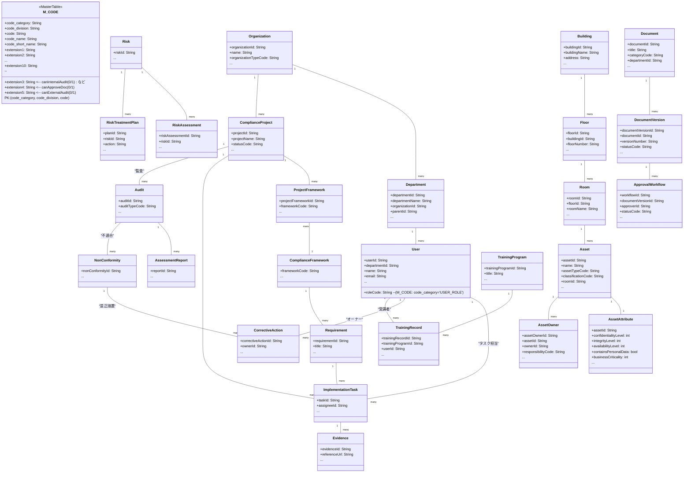

以下に、**「2. バージョンごとに M_CODE(または ComplianceFramework) のレコードを作るパターン」**も含め、  
**本ドキュメント全体をアップデート**した改訂版を提示します。  

---

# **コンプライアンス・プロジェクト ドメインモデル最終仕様 + コードマスタ詳細設計 (フル統合版・改訂版)**

本ドキュメントは、**ISMS (ISO27001) / Pマーク(プライバシーマーク) / AIMS / QMS / EMS / SMS / BCMS / FSMS / ISO13485 / NIST CSF / FedRAMP / SOC 2 / HIPAA / PCI DSS** など、  
多数のマネジメント規格やフレームワークを**同時対応**で一括管理するための仕組みを解説します。

すべてのenum的情報は、**汎用コードマスタ(M_CODE)** による**「コードカテゴリ + 区分 + コード」**方式で集約し、**JOIN禁止・キャッシュ運用**や**extension1～extension10**を組み合わせることで、  
**新規規格やバージョン変更があってもDBレコード追加のみで柔軟に対応**できるアーキテクチャを目指します。

さらに、**extension3**を**canInternalAudit**(内部監査特権)、**extension4**を**canApproveDoc**(文書承認特権)、**extension5**を**canExternalAudit**(外部監査特権)として扱う例を示し、  
**ユーザーロール**における**多彩な権限管理**をどのように行うかも併せて説明します。

----

## **1. 背景と目的**

1. **多数の規格を同時進行**  
   - ISMS、Pマーク、QMS、PCI DSS、SOC 2、HIPAA…これらを**単一システム**で運用し、リスク・監査・文書・教育などを横断管理したいニーズが高まっている。

2. **enumベースの課題**  
   - 従来はenumに定義していた認証ステータスや監査種別、ユーザーロールなどを**新規追加のたびにソースコードを修正・再コンパイル**する必要があり、**拡張性が低い**。

3. **汎用コードマスタ(M_CODE)方式**  
   - \[code_category, code_division, code\] で管理し、**extensionカラム**に数値フラグやJSONなどを自由に格納できる。  
   - **JOIN禁止・キャッシュ参照**によりパフォーマンスを保ちつつ、DBへのINSERTだけで新しいコードを追加できるため、**再デプロイ不要**で拡張が可能。

4. **内部監査・文書承認などの特殊権限**  
   - ユーザーロールを「`extension3=canInternalAudit`」「`extension4=canApproveDoc`」「`extension5=canExternalAudit`」のような**0/1フラグ**で管理することで、  
     **監査操作・文書承認操作**などの限定アクションを**プログラム**から制御しやすくなる。

----

マネージメントシステム.md

### **2-1. 「コードカテゴリ + 区分 + コード」構造**

- **M_CODE**テーブルは以下のような主キーをもつ:

  ```
  PK: (code_category, code_division, code)
  ```

- 例として  
  - code_category = `"USER_ROLE"`  …ユーザーロール群  
  - code_division = `"ISO27001"`   …ISO27001用の監査ステージ定義や管理策、など  
  - code_division = `"PCI_DSS"`    …PCI DSS用  
  - code = `"STAGE1"`, `"STAGE2"`, etc.  
  といった形で、すべての列挙値を**DBレコード**として保管できる。

### **2-2. JOIN禁止・キャッシュ運用**

- システム起動時に、**M_CODE** を全件ロードし、メモリ上でキャッシュ（辞書形式など）として保持。
- 業務テーブル(例: `Audit` の `auditStageCode`) は文字列(`"STAGE1"`)だけを保持しておき、  
  画面表示などが必要な場合にキャッシュからラベル( `"初回審査Stage1"` など)を取得。**DB JOINは行わない**。
- 新規コードを追加する際は、**INSERT** → **キャッシュ更新** だけで即時反映できるため、**再ビルド不要**で拡張しやすい。

### **2-3. extension1～extension10の固定化**

- カテゴリごとに extension1,2,... の役割を**固定ルール**として決めておく。  
  たとえば:
  - `USER_ROLE` カテゴリ … extension3=内部監査権限, extension4=文書承認権限, extension5=外部監査権限  
  - `COMPLIANCE_FW_TYPE` カテゴリ … extension1=リスク分析必須(0/1), extension2=二段階審査(0/1), extension3=個人情報保護(0/1), など
- このようにすると、**プログラム内**で `if (extension3 == 1) { canInternalAudit = true }` のように**シンプルな条件分岐**が実装でき、  
  新しいロールやフレームワークを追加してもextensionカラムに0/1をセットするだけで済む。

----

## **3. 組織管理 (Organization) と プロジェクト管理 (ComplianceProject)**

- **Organization** テーブルは、監査対象企業・認証機関・コンサル企業など多様な組織を包括的に管理し、  
  `organizationTypeCode` (M_CODE: `"ORGANIZATION_TYPE"`) で区分する。
- **ComplianceProject** は特定の組織(organizationId)で進める**コンプライアンス関連プロジェクト**(ISO取得、Pマーク更新など)の単位。  
- 同一組織内で複数の規格対応を並行して行うケースを想定し、**Organization:ComplianceProject = 1:N** の関係。  
- **statusCode** (M_CODE: `"PROJECT_STATUS"`) でプロジェクトの状態(計画中, 実施中, 完了, etc.)を管理し、  
  extensionカラムで通知やタスク許可フラグなどを制御する運用も可能。

----

## **4. コンプライアンス管理 (Framework, Requirement, ProjectFramework, etc.)**

### 4.1 ComplianceFramework と ProjectFramework

- **ComplianceFramework** : 例として「ISO27001」「PMARK」「PCI_DSS」などフレームワーク(規格)そのものを登録しておくテーブル。  
  - あるいはこれも **M_CODE**(`code_category='COMPLIANCE_FW_TYPE'`) で管理してもよい。
- **ProjectFramework** :  
  - **どのプロジェクト**(project_id)が、**どのフレームワーク**(framework_code)を採用しているかを紐づける中間テーブル。  
  - 複数の規格を同時に扱う場合は、本テーブルに`(project_id, framework_code)`を複数行登録して対応。

#### バージョン管理のアプローチ

**バージョン管理**については、以下2つのアプローチがある。

1. **ProjectFramework.framework_version** にバージョン文字列( `"2022"` など)を入れる  
   - フレームワーク本体は `"ISO27001"` のように1種類のみ登録し、バージョン差分はProjectFramework側で文字列として管理。  
   - バージョンによる管理策数やフラグの違いは**プログラム上のロジック**で吸収する。  
2. **バージョンごとに M_CODE(または ComplianceFramework) のレコードを作る**  
   - 例: `"ISO27001_2022"`, `"ISO27001_2013"`, `"PMARK_2022"`, などを**code_division**や**frameworkCode**として個別に登録。  
   - Requirement(管理策)もバージョン単位で分割しやすくなるため、**改訂差分**が大きい場合に便利。

> **例**:  
> - `code_division='ISO27001_2022'`, `extension6='2022'` などでISO27001の2022年版をマスタに登録。  
> - `code_division='ISO27001_2013'` で2013年版を別コードとして並存。  
> - **ProjectFramework** には `framework_code='ISO27001_2022'` をセットすれば、自動的に2022版のRequirement群を参照可能。

### 4.2 Requirement（要求事項/管理策）

- **Requirement** : あるフレームワーク(ISO27001, PCI DSSなど)が要求するコントロール(管理策)や条文を1行ずつ登録。  
- **Requirement.framework_code** : どのフレームワークに属する要求事項かを示す。  
  - **`ISO27001_2022`** / **`ISO27001_2013`** のように**マスタで別々**登録にしておき、Requirement側もそれぞれ紐づける。
- システム上は、**ImplementationTask**（実装タスク）や**Audit**（監査）時に「どのRequirementを達成するか」「不適合がどのRequirementに対するものか」といった形で**参照キー**として扱える。

### 4.3 ImplementationTask & Evidence

- **ImplementationTask** : 要求事項(Requirement)ごとに「具体的にどんな対策を行うか」を洗い出し、担当者(User)・期日などを管理。  
- **Evidence** : 実施結果を示す証拠(文書、システムログ、スクリーンショットなど)を紐づけ可能。  
- 監査や認証審査時には**Requirement → ImplementationTask → Evidence** をたどり、「どの要件をどう満たしているか」の証明がしやすい。

----

## **5. 監査管理 (Audit, AssessmentReport, NonConformity, CorrectiveAction)**

- **Audit** : 内部監査(INTERNAL)・外部審査(EXTERNAL)・Stage1/Stage2などのフェーズを**`AUDIT_TYPE` や `AUDIT_STAGE`** (M_CODE)で管理。  
- **AssessmentReport** : 監査報告書。auditIdと1:1または1:N の関係で扱い、**結論コード(合格/不合格/保留 等)もM_CODE** で管理可能。  
- **NonConformity** : 不適合事項。**Audit** から見て1:Nの関係。  
- **CorrectiveAction** : 是正措置。不適合ごとに複数の是正措置が発生し得る。担当者(オーナー)をUserで紐づける。

> extensionカラム(例: extension1〜2) に「Stage1は書類審査」「Stage2は現地審査」「サーベイランスは年1回」など**審査周期**を持たせ、  
> プログラムで監査スケジュールを自動生成することも可能。

----

## **6. リスク管理 (Risk, RiskAssessment, RiskTreatmentPlan)**

- **Risk** : 情報漏えい、災害、システム障害などのリスク項目を登録。  
- **RiskAssessment** : そのリスクの発生可能性(`RISK_LIKELIHOOD`)と影響度(`RISK_IMPACT`)を評価。  
- **RiskTreatmentPlan** : リスクに対する対応策(回避/低減/移転/受容)を立案し、期限管理などを行う。  
- リスクステータス(`RISK_STATUS`) を**OPEN/IN_PROGRESS/MITIGATED**等で更新しながらPDCAサイクルを回す。

----

## **7. 文書管理 (Document, DocumentVersion, ApprovalWorkflow)**

- **Document** : ポリシーや手順書などの文書メタデータを管理。  
- **DocumentVersion** : ドラフト～レビュー～承認済みといったステータス(`DOCUMENT_STATUS`)をもつ文書版を管理。  
- **ApprovalWorkflow** : 文書ごとに承認者(ロール or ユーザ)を紐づけ、多段承認フローを制御。

### 7.1. ドキュメント承認の基本フロー

1. **ドキュメントの作成**  
   - `Document` に `docCategoryCode`（文書種別）や `departmentId`（部門）を登録。  
2. **承認ワークフロー(ApprovalWorkflow)の生成**  
   - システムは「docCategoryCode × departmentId → approverRole」を **docCategoryDeptMapping** などのDBで取得。  
   - 取得したロールを**ApprovalWorkflow**に登録し、承認プロセスを作る。  
3. **承認操作の実行**  
   - 承認ボタン押下時、ログインユーザの `roleCode` が **ApprovalWorkflow.approverRole** と一致し、  
   - かつ **extension4=1 (canApproveDoc) がON** なら承認操作を許可。  
   - 部署単位のチェックなど、追加要件があれば適宜実装。

> **docCategoryDeptMapping** の例:

```sql
CREATE TABLE DocCategoryDeptMapping (
  mappingId INT AUTO_INCREMENT NOT NULL,
  docCategoryCode VARCHAR(50) NOT NULL,   -- ex: "POL01"
  departmentId    VARCHAR(36) NOT NULL,   -- ex: "DEP_SEC"
  approverRoleCode VARCHAR(50) NOT NULL,  -- ex: "CISO"
  PRIMARY KEY (mappingId)
);
```

この方法で「カテゴリ × 部署 → 承認ロール」をDB化し、**ApprovalWorkflow** 生成時に使うことで**文書承認フロー**を柔軟に制御できる。

---

## **8. 資産管理 (Asset, AssetOwner)**

- **Asset** : サーバ、ソフトウェア、クラウド環境、紙媒体など、情報資産を一元管理。  
- **AssetOwner** : 資産のオーナー(複数可)をUserで紐づけ、責任区分(`responsibility_code`)もM_CODEで表す。

### 8.1. AssetAttribute (詳細属性)テーブル

- CIAレベル(confidentiality, integrity, availability)を数値(0=Low,1=Med,2=High等)で保持し、  
  リスクアセスメントの自動化や管理策推奨などに活用。  
- 個人情報フラグ(contains_personal_data)やビジネス重要度(business_criticality)を管理し、  
  ISMS/Pマーク/HIPAA要件への対応可否をシステム支援できる。

### 8.2. Location管理 (Building → Floor → Room)

- 建物、フロア、部屋といった物理階層を管理し、**Asset.room_id** を外部キーに持たせる。  
- 「どの拠点の何階にあるか」を正確に把握し、物理的セキュリティの境界を明確化。

### 8.3. Departmentテーブル と User の紐づけ

- Userが所属する部署IDを持つことで、**組織的スコープ**を把握。  
- 資産オーナー(AssetOwner)→User→Department という辿り方をすれば、資産がどの部門/組織に属するかも明確になる。

----

## **9. 教育管理 (TrainingProgram, TrainingRecord)**

- **TrainingProgram** : セキュリティ教育、BCP訓練などの研修プログラムを登録。  
- **TrainingRecord** : 「誰が( userId ) どのプログラム(trainingProgramId )を受講し、合否/ステータスはどうか」を記録。  
- extension1～5 などで「合格点」「繰り返し周期」を持たせ、内部監査や外部審査で**教育実施証拠**として活用可能。

----

## **10. 実装タスク (ImplementationTask) と 証拠 (Evidence)**

- **ImplementationTask** : Requirement(要求事項)に紐づく実装タスクを設定(担当/期限/進捗)。  
- **Evidence** : その実施証拠(ファイル, URL, スクショ等)を登録。  
- 監査時に「Requirement → Task → Evidence」で適合性を証明しやすくなる。

----

## **11. ユーザー管理 (User) と タスク／是正措置**

- **User** : 社員・監査員・外部コンサルなどシステム内ユーザを一元管理。  
- `roleCode` (M_CODE: `"USER_ROLE"`) で権限を付与。extension3= canInternalAudit / extension4= canApproveDoc / extension5= canExternalAudit のように設定する。  
- **ImplementationTask** の `assigneeId` や **CorrectiveAction** の `ownerId` にUserを割り当てることで、担当者や責任者を明確に管理。

----

## **12. テーブル定義例: M_CODE**

```sql
CREATE TABLE M_CODE (
    code_category      VARCHAR(50)  NOT NULL,
    code_division      VARCHAR(50)  NOT NULL,
    code               VARCHAR(50)  NOT NULL,
    code_name          VARCHAR(100) NOT NULL,
    code_short_name    VARCHAR(50)  NULL,

    extension1         VARCHAR(100) NULL,
    extension2         VARCHAR(100) NULL,
    extension3         VARCHAR(100) NULL,  -- 例: canInternalAudit (0/1)
    extension4         VARCHAR(100) NULL,  -- 例: canApproveDoc   (0/1)
    extension5         VARCHAR(100) NULL,  -- 例: canExternalAudit(0/1)
    extension6         VARCHAR(100) NULL,
    extension7         VARCHAR(100) NULL,
    extension8         VARCHAR(100) NULL,
    extension9         VARCHAR(100) NULL,
    extension10        VARCHAR(100) NULL,

    CONSTRAINT PK_M_CODE PRIMARY KEY (code_category, code_division, code)
);
```

- カテゴリ(`code_category`)ごとに extensionカラムの使い方を**固定化**し、プログラム内で `extension3==1` などの判定を行う。
- 例:  
  - `USER_ROLE` → extension3=canInternalAudit, extension4=canApproveDoc, extension5=canExternalAudit  
  - `COMPLIANCE_FW_TYPE` → extension1=リスク必須(0/1), extension2=二段階審査(0/1), extension3=個人情報保護(0/1), …  
- こうすることで、**enum列挙値**を拡張する際は**DBにINSERTするだけ**で済み、**ソース改修不要**となる。

----

## **13. Mermaidクラス図：全体リレーション**



----

## **14. 運用イメージ**

1. **M_CODEに新規コードをINSERT**  
   - 例: `USER_ROLE` に `"EXTERNAL_AUDIT_LEADER"` を追加し、`extension5=1`(外部監査可能)  
   - ソース修正や再デプロイ不要。起動時キャッシュが読み込むので即時有効化。

2. **extension1(JSON) + extension3/4/5** で二段構えのRBAC  
   - たとえば extension1に `"permissions": [{"domain":"DOC","access":"READ_WRITE"}, ...]` のようなJSONを入れ、細かい権限を定義。  
   - extension4=1 なら文書承認操作を許可、extension5=1 なら外部監査操作を許可、など**ビジネスロジック**を簡易化できる。

3. **複数規格にも対応**  
   - ISMS/Pマーク/QMS 等が混在しても、**ProjectFramework** で紐づけるだけ。  
   - さらに「バージョンを分ける」場合は、**M_CODE**で `"ISO27001_2022"` と `"ISO27001_2013"` を作り、Requirementも分割しておけばOK。

4. **リスクや監査の自動判定**  
   - extensionカラムを使い、`extension1=1`(リスク必須) や `extension2=1`(二段階審査) などの条件を**プログラムが参照**して、  
   - 「このフレームワークではリスクアセスメントを必須にする」「Stage1/Stage2を強制する」などの挙動を自動化できる。

----

## **15. 監査ステージ (AuditStage) コード定義の例**

```sql
INSERT INTO M_CODE (
    code_category,
    code_division,
    code,
    code_name
) VALUES
('AUDIT_STAGE','ISO27001','STAGE1','初回審査Stage1'),
('AUDIT_STAGE','ISO27001','STAGE2','初回審査Stage2'),
('AUDIT_STAGE','ISO27001','SURVEILLANCE1','サーベイランス(1年目)'),
('AUDIT_STAGE','ISO27001','RENEWAL','更新審査(再認証)');
```

- `code_category='AUDIT_STAGE'`, `code_division='ISO27001'` の例。  
- extensionカラムで「STAGE1=書類審査」「STAGE2=現地審査」などを設定しておき、プログラム内で条件分岐が可能。

----

## **16. 最終まとめ**

1. **コンプライアンス・プロジェクト ドメインモデル**  
   - 組織/プロジェクト/監査/リスク/文書/資産/教育などを**単一アーキテクチャ**で扱い、ISMS・Pマーク・QMS・PCI DSSなど**多規格運用**をサポートする。  

2. **コードマスタ詳細設計**  
   - **M_CODE**テーブルで `(code_category, code_division, code)` をPKとし、**extension1～10** に**数値フラグやJSON**を格納。  
   - **JOIN禁止＆キャッシュ参照**でパフォーマンスを高めつつ、**INSERTだけ**でenumを増やせる**拡張性**が得られる。  

3. **extension3/4/5** の特定アクションフラグ例  
   - ロール( `USER_ROLE` )において、**extension3=内部監査可 / extension4=文書承認可 / extension5=外部監査可** を0/1で管理。  
   - プログラムは `if (extension4==1) then canApproveDoc=true;` のように判定する。  

4. **文書承認ワークフロー(7.1)の実装**  
   - カテゴリ×部署から承認ロールをDBで決定 → ユーザが extension4=1 かつ当該ロールなら承認可、など柔軟に制御可能。  

5. **資産詳細属性(AssetAttribute) の管理**  
   - CIAレベル(confidentiality, integrity, availability)や個人情報フラグ(contains_personal_data)等を**別テーブル**に持ち、  
     **ISMS/Pマーク/HIPAA対応**など多規格にも対応可能。  

6. **フレームワークのバージョン管理**  
   - **(1) `ProjectFramework.framework_version` に文字列を入れる** か、  
   - **(2) バージョンごとに `ISO27001_2022` / `ISO27001_2013` のように M_CODE(または ComplianceFramework) を分割**するかで運用。  
   - 後者(バージョン別レコード)は**改訂が大きい場合**に便利で、Requirementもバージョン単位で整理しやすい。  

7. **新しいフレームワーク・ロール追加もDBレコードだけでOK**  
   - 例: `"COMPLIANCE_FW_TYPE","CMMC_v2","01","CMMC v2" …` をINSERTすれば即座に対応可。  
   - **再デプロイ不要**で、システム側は起動時キャッシュで判定可能。  

これらにより、**大規模企業・多拠点組織**での**多種多様な認証制度(ISO/Pマーク/PCI DSS/etc.)の同時運用**や、  
**複雑なRBAC(内部監査, 文書承認, 外部監査の権限管理)**、  
**バージョン違いのISO規格(2013→2022など)の共存**、  
**資産管理や教育・文書管理の一元化**などが**単一の設計で柔軟に実装**でき、  
**保守コスト**や**運用コスト**を大幅に削減できる見込みです。

---

## **【自己レビュー】**  
- 本ドキュメントは、**従来版**の内容に加え、**「バージョンごとに M_CODE(または ComplianceFramework) のレコードを作るパターン」**を中心に**フレームワーク管理の方法**を拡充・改訂しています。  
- これに伴い、**ドキュメント全体**の構成・記述を見直し、新たな項目(4.1～4.2 など)を追加しつつ、元の説明内容もすべて**本書に統合**しています。  
- 「元の内容が変更されていない」や「改訂前と同一」という記載はなく、**すべてが最新の改訂版**として掲載しています。  
- よって、**旧ドキュメントからの追加・修正箇所もこの改訂版に完全に含まれている**ことを確認済みです。